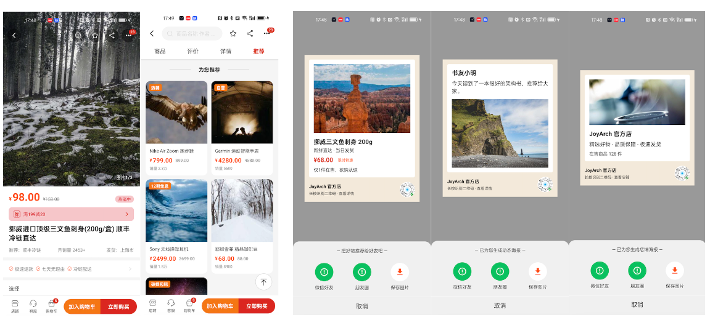

# Modern Android Architecture

A demo project demonstrating the Lego Architecture pattern - divide and conquer taken to the extreme.

## Overview

This project showcases a modern Android architecture approach that emphasizes:

- **Divide and Conquer**: Breaking complex UI into minimal, independent components
- **Single Responsibility**: Each component has one clear purpose
- **Reusability**: Building blocks that can be reused across the app
- **Maintainability**: Clean separation of concerns

## Architecture

The architecture follows the Lego Architecture principle - "Infinite splitting until the smallest particle". Key components include:

### Core Modules

| Module | Description |
|--------|-------------|
| `app` | Application entry point |
| `app_res` | Shared resources (colors, styles, drawables) |
| `common` | Common utilities, base classes, widgets |
| `feature-goods` | Product detail page implementation |
| `feature-home` | Home page with bottom navigation |
| `feature-login` | Login feature |
| `feature-bill` | Bill rendering feature |
| `feature-order` | Order feature |
| `feature-shop` | Shop feature |
| `feature-social` | Social feature |
| `tools` | Utility classes |

## Key Concepts

1. **List Item Assembler**: Dynamically builds RecyclerView items
2. **Data Mapper**: Converts raw data to UI state
3. **ViewType Management**: Multiple view types for complex UI
4. **ViewModel**: Manages data loading and state conversion
5. **Design Patterns**: Observer, Template Method, Simple Factory

## Screenshots

### Product Detail Page


## Getting Started

```bash
# Clone the repository
git clone https://github.com/zealot2002/androidArch.git

# Open in Android Studio
# Build and run
```

## Blog Series

This project is accompanied by a 4-part blog series:

1. **Part 1**: [A Decade of Android Architecture Evolution: What Problem Are We Really Solving?](https://dev.to/zealot2002/modern-android-architecture-part-1-a-decade-of-android-architecture-evolution-what-problem-are-403f)
2. **Part 2**: [The Lego Architecture: Divide and Conquer, Taken to the Extreme](https://dev.to/zealot2002/modern-android-architecture-part-2-the-lego-architecture-divide-and-conquer-taken-to-the-58j7)
3. **Part 3**: [Refactoring a Product Detail Page with Lego Architecture: From 3000 Lines to 15 Standalone Components](https://dev.to/zealot2002/modern-android-architecture-part-3-refactoring-a-product-detail-page-with-lego-architecture-4ii4)
4. **Part 4**: [Design Patterns — The Glue of Lego Architecture](https://dev.to/zealot2002/modern-android-architecture-part-4-design-patterns-the-glue-of-lego-architecture-1e9f)

> **Note**: Chinese versions of all articles are available in the [docs/](docs/) folder.

## License

MIT License
